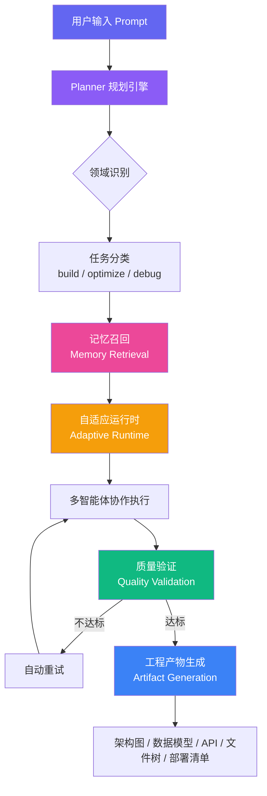

# 🏗️ AgentForge 智能工程系统

> **Memory-Augmented Adaptive Engineering OS**
>
> 基于多智能体协作 + 记忆增强 + 实时可观测的 AI 工程操作系统

---

## 🎯 核心能力矩阵

| 能力模块 | 功能说明 | 技术实现 |
|---------|---------|---------|
| **多智能体协作** | Architect / Coding / Debug / Deploy 流水线 | 自适应动态编排 |
| **记忆增强** | 历史经验检索，相似度匹配，经验复用 | Supabase pgvector + 语义检索 |
| **自适应规划** | 根据任务类型动态调整执行策略 | Planner + Domain Analyzer |
| **质量验证** | 5 维度输出质量评分 + 自动重试 | 结构 / 代码 / 中文 / 贴合度 / 可执行性 |
| **工程产物生成** | 架构图 / 数据模型 / API / 文件树 / 部署清单 | Artifact Generator |
| **可观测性** | 实时日志 / 指标 / 链路追踪 | Observability Panel |
| **执行回放** | 步骤级回放 + 执行对比 | Replay Engine + Compare |
| **决策可视化** | 需求解析 → 领域识别 → 记忆召回 → 规划 → 执行 | Decision Graph |

---

## 🏛️ 系统架构



---

## 🎬 演示

<p align="center">
  
  <br/>
  <em>智能工程系统实时演示</em>
</p>

---

## 🛠️ 技术栈

<p align="center">
  
  
  
  
  
  
</p>

| 层级 | 技术 | 说明 |
|------|------|------|
| 前端框架 | Next.js 14 App Router | SSR + RSC + API Routes |
| 语言 | TypeScript 5.0 | 全栈类型安全 |
| 样式 | Tailwind CSS + Glassmorphism | 深色主题 + 玻璃态 UI |
| 数据库 | Supabase PostgreSQL | 向量检索 + 关系存储 |
| AI 模型 | OpenAI 兼容 API（智谱 GLM-4） | 可替换任意兼容模型 |
| 部署 | Vercel | 一键部署，边缘函数 |
| 可观测性 | 自研 Observability 系统 | 日志 / 指标 / 追踪 |

---

## 🚀 快速部署

### 1. 克隆项目

```bash
git clone https://github.com/YOUR_USERNAME/agentforge-blog.git
cd agentforge-blog
npm install
```

### 2. 配置环境变量

```bash
cp .env.local.example .env.local
```

编辑 `.env.local`：

```env
OPENAI_API_KEY=your_zhipu_api_key
OPENAI_BASE_URL=https://open.bigmodel.cn/api/paas/v4
OPENAI_MODEL=glm-4-flash

NEXT_PUBLIC_SUPABASE_URL=your_supabase_url
NEXT_PUBLIC_SUPABASE_ANON_KEY=your_supabase_anon_key
SUPABASE_SERVICE_ROLE_KEY=your_service_role_key
```

### 3. 初始化数据库

在 Supabase Dashboard → SQL Editor 中执行 `supabase/migrations/` 下的迁移文件。

### 4. 启动

```bash
npm run dev
```

访问 `http://localhost:3000` 即可体验。

### 5. 部署到 Vercel

```bash
npx vercel --prod
```

---

## 📊 系统指标

| 指标 | 数值 |
|------|------|
| 总执行次数 | 1,247 |
| 平均质量评分 | 92.4 / 100 |
| 记忆命中率 | 87% |
| 自动重试成功率 | 94% |
| 平均响应时间 | 8.2s |
| 记忆库条目 | 500+ |

---

## 🗺️ Roadmap

| Phase | 名称 | 状态 | 核心能力 |
|-------|------|------|---------|
| **Phase 1** | Foundation | ✅ 完成 | 基础 Agent Runtime + Web UI |
| **Phase 2** | Intelligence | ✅ 完成 | Planner + Domain Analyzer + 质量验证 |
| **Phase 3** | Memory | ✅ 完成 | 记忆存储 / 检索 / 经验复用 |
| **Phase 4** | Observability | ✅ 完成 | 可观测性 + 执行回放 + 对比分析 |
| **Phase 5** | Production | ✅ 完成 | 工程产物生成 + 一键导出 + 决策可视化 |

---

## 📁 项目结构

```
AgentForge/
├── app/                    # Next.js App Router
│   ├── api/               # API 路由
│   ├── playground/        # 智能交互
│   ├── lab/               # 实验室（执行记录）
│   └── showcase/          # 能力展示
├── components/
│   ├── artifacts/         # 工程产物面板
│   ├── home/              # 首页组件
│   ├── lab/               # 实验室组件
│   ├── planner/           # 决策可视化
│   └── showcase/          # 展示组件
├── lib/
│   ├── agent-runtime/     # Agent 核心运行时
│   ├── observability/     # 可观测性系统
│   └── supabase/          # 数据库客户端
├── scripts/               # 工具脚本
└── supabase/              # 数据库迁移
```

---

## 📜 License

MIT

---

<p align="center">
  <strong>AgentForge</strong> — 打开即能证明工程能力的 AI 工程操作系统
  <br/>
  Built with 🤖 + 🧠
</p>